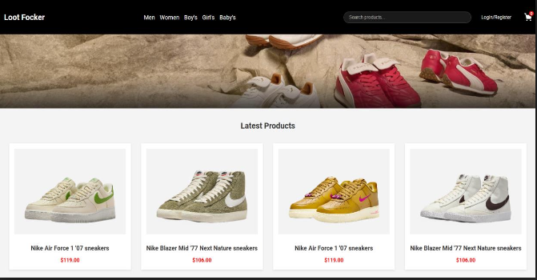
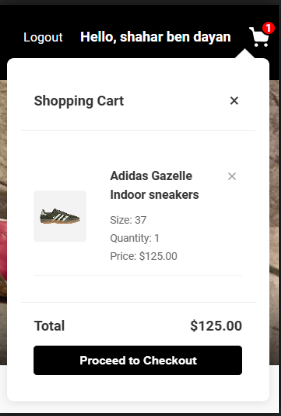

# 👟 Loot Focker - Full-Stack E-Commerce Shoe Store

**Loot Focker** is a complete e-commerce platform for fashion and footwear, developed as part of an academic full-stack project. It allows users to browse, search, filter, purchase, and track their shoe orders with ease. The system includes both a customer-facing site and a comprehensive admin dashboard.

## 📦 Project Highlights

- Modern UI for users to explore and purchase shoes.
- Dynamic shopping cart and order tracking.
- Admin panel with CRUD operations and real-time data visualization.
- RESTful API-based architecture.
- Responsive design for all screen sizes.

---

## 🚀 Getting Started

To run the project locally:

1. Clone the repository.
2. Install dependencies:

```bash
npm install
```

3. Create a `.env` file in the root directory (see `.env.example` for structure).
4. Start MongoDB if needed.
5. Launch the app:

```bash
./start.sh
```

6. Visit:

```
http://localhost:3000/
```

---

## 🧭 Site Overview

### 🏠 Homepage
Highlights the latest product arrivals and featured collections.



### 🛍️ Product Catalog
Browse and filter the entire collection by brand, price, size, and more.


### 🧺 Shopping Cart
Add, remove, and manage items before checkout.



### 👤 Personal Area
Track your past orders and view their status.


### 🛠️ Admin Dashboard
Admins can:
- Edit and manage product listings
- Manage users and orders
- View real-time product statistics with D3.js graphs


---

## 🧪 Environment Variables

To run the project, create a `.env` file in the root directory using this format:

Refer to the included `.env.example` for required keys.

```
DB_MONGODB=mongodb+srv://<your-db-uri>
```

> ❗ Never commit `.env` files to version control.

---

## ⚙️ Tech Stack

- **Frontend:** HTML5, CSS3, JavaScript (Vanilla + jQuery)
- **Backend:** Node.js, Express.js
- **Database:** MongoDB Atlas
- **Visualization:** D3.js (Admin panel)
- **Architecture:** MVC (Model-View-Controller)
- **Extras:** jQuery, AJAX, RESTful APIs

---

## 👨‍💻 About the Project

This project was developed by four Computer Science students as part of a semester-long web development course. It showcases full-stack architecture, user management, asynchronous communication, admin tooling, and more.

---

## 🙌 Contribute

Feel free to fork, clone, submit issues, or improve the project.

> **Note:** This is a student project. Payment, login authentication, and email services are simulated or omitted.

---
